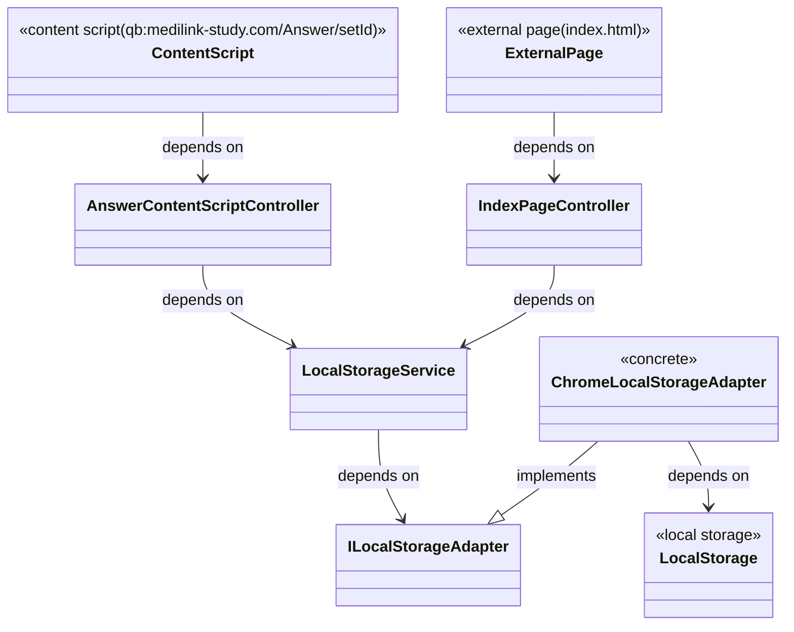

# 草案

## 概要

QB国試の回答状況とそれに応じた復習間隔を管理し、適切なタイミングで復習する問題を提示する。

## 問題の復習ルール

初めて回答した問題は、

- 「-」または「×」の場合は1日後に復習
- 「△」の場合は2日後に復習
- 「◯」の場合は3日後に復習
- 「◎」の場合は4日後に復習

今日が前回回答日付のX日後、かつ、今日が復習予定日以上の場合、

- 「-」または「×」の場合は、明日に復習
- 「△」の場合は、今日のX日後に復習
- 「◯」の場合は、今日の1.5X日後に復習(1.5Xは切り上げて整数にする)
- 「◎」の場合は、今日の2X日後に復習

今日が前回回答日付のX日後、かつ、今日が復習予定日未満の場合、

- 「-」または「×」の場合は、明日に復習
- それ以外の場合は、復習予定日に+X日する

連問(例えば115C72-115C74が1セットの場合)は、それぞれの小問(115C72, 115C73, 115C74)について上記のルールを適用する。

## データ構造

「セットid」を

- 単一問題に対し、その問題のid(単一問題115C71ならばセットidは115C71)
- 連問に対し、最初の問題のid(連問115C72-115C74ならばセットidは115C72)

と定義する(各小問の問題ページは`https://qb.medilink-study.com/Answer/${setID}`になる)。


review_plansのcompletedは、復習を実施した場合にtrueにする。本日分、またはそれより1つ前のanswer_resultsに紐づくreview_plansが復習日程の決め方に必要。

## chrome拡張機能に関する仕様

### content script

- 「解答を確認する」ボタン
- 「自分が登録した結果」の編集イベント

をトリガーとして、データベースを更新

### external page

問題の管理状況を表示する。

- その日の復習予定問題一覧を表示、問題をクリックするとiframeで表示する。

### storage

chrome extensionのlocal storageを利用。content scriptからはlocal storageに書き込む。
後で、各デバイスでのlocal storageの同期のために、google storageやdropboxを利用可能にする。external pageを開いたタイミングで外部ストレージからlocal storageへ書き込みを行い、「デバイス間同期」ボタンを押下したタイミングでlocal storageから外部ストレージへの書き込みを行う。

## architecture



Controllerはlogics/*.tsに適宜依存

## local storageのバージョニング

local storageへの保存形式のバージョニングは、LocalStorageServiceで行う。

```ts
type LocalStorageVer1Schema = {
    version: 1
    // ...
}
type LocalStorageVer2Schema = {
    version: 2
    // ...
}
async function convertToLocalStorageVer2(adapter: ILocalStorageAdapter){
    // ...
}
```

LocalStorageServiceは、インスタンス生成時local storageの`version`キーを読み込み、その値に応じてバージョンアップを行う。
